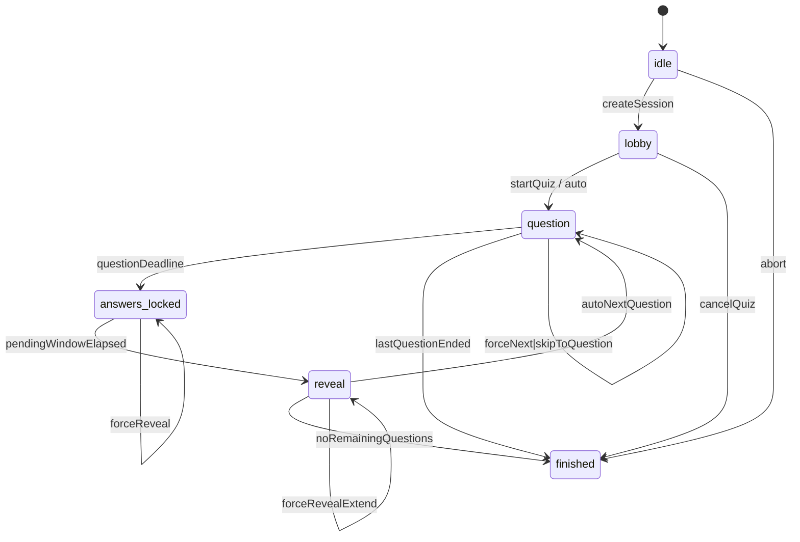

# クイズセッション状態設計とメッセージ仕様

`requirements.md` に基づき、Durable Object (DO) によるクイズセッション管理の状態遷移と WebSocket メッセージ仕様を定義する。参加者 UI・管理者 UI の双方から参照し、フェーズ 04 以降の実装指針とする。

## 1. Durable Object 状態モデル
| フィールド | 型 | 説明 |
| --- | --- | --- |
| `sessionId` | string | セッション識別子。URL/ルーティングで共有 |
| `quizId` | string | 進行対象のクイズ ID |
| `status` | `"idle" \| "lobby" \| "question" \| "answers_locked" \| "reveal" \| "finished"` | セッション状態 |
| `questionIndex` | number | 現在フォーカス中の問題の 0-based index。`-1` は未開始 |
| `questionStartedAt` | number (epoch ms) | 現在の問題が開始された時刻 |
| `questionDeadline` | number (epoch ms) | 回答締切の時刻 |
| `questionLockedAt` | number (epoch ms) | 回答受付を締め切った時刻 |
| `questionRevealAt` | number (epoch ms) | 結果表示を開始する予定時刻 |
| `questionRevealEndsAt` | number (epoch ms) | 次の問題へ自動遷移する予定時刻 |
| `autoProgress` | boolean | 自動進行フラグ。管理者が介入で false になるケースあり |
| `participants` | Map<string, ParticipantState> | 接続中参加者のステータス |
| `pendingResults` | Map<string, AnswerSummary> | 回答締切後の結果計算キャッシュ |
| `questions` | QuestionContent[] | セッション開始時に読み込んだ問題リスト。各要素は `pendingResultSec` と `revealDurationSec` (秒) を保持 |
| `adminSockets` | Set<WebSocketId> | 管理画面向け WebSocket 接続一覧 |
| `participantSockets` | Map<string, Set<WebSocketId>> | 参加者 ID ごとの WebSocket 集合 |
| `queue` | Array<PendingCommand> | 管理者操作や自動遷移の予定キュー |

補助型例:
```ts
interface ParticipantState {
  userId: string;
  displayName: string;
  connected: boolean;
  lastSeen: number;
  answers: Record<
    string,
    {
      choiceId: string;
      submittedAt: number;
      isCorrect?: boolean;
      elapsedMs?: number;
    }
  >;
  score: number;
  totalElapsedMs: number;
}

interface AnswerSummary {
  questionId: string;
  totals: Record<string, number>; // choiceId -> count
  correctChoiceIds: string[];
}

interface QuestionContent {
  id: string;
  text: string;
  timeLimitSec: number;
  pendingResultSec: number; // 回答締切後の集計待機秒数
  revealDurationSec: number; // 正解表示中の待機秒数
  choices: Array<{
    id: string;
    text: string;
    isCorrect: boolean;
  }>;
}

interface PendingCommand {
  type: 'auto-next' | 'force-end' | 'force-start' | 'skip';
  scheduledAt: number;
  payload?: Record<string, unknown>;
}
```

## 2. 状態遷移図


- `idle`: セッションが DO に作成された直後。クイズ設定や参加 URL 発行のみが許可される。
- `lobby`: 参加者が接続し待機する状態。管理者の `startQuiz` 操作で `question` に遷移。
- `question`: 問題が表示され回答受付中。制限時間経過か管理者操作で `answers_locked` へ。
- `answers_locked`: 回答は締切済みで集計待機中。結果を確定すると `reveal` へ遷移。
- `reveal`: 正解・結果を表示。自動進行が有効なら設定時間経過後に次の `question` へ。
- `finished`: セッション終了。結果閲覧のみ許可。

## 3. 遷移イベント詳細
| イベント | ソース状態 | デスティネーション | トリガー | 主なアクション |
| --- | --- | --- | --- | --- |
| `createSession` | `[ * ]` | `idle` | HTTP API でセッション生成 | D1 にセッション行追加、DO インスタンス初期化 |
| `startQuiz` | `lobby` | `question` | 管理画面操作 | `questionIndex=0`、タイマー開始、`quiz_start`/`question_start` をブロードキャスト |
| `auto` | `lobby` | `question` | 自動開始設定 (省略可) | 同上。開始時刻を即時記録 |
| `questionDeadline` | `question` | `answers_locked` | タイマー満了 | 回答締切、`question_locked` ブロードキャスト、`questionRevealAt` を設定 |
| `revealReady` | `answers_locked` | `reveal` | `pendingResultSec` 経過 or `forceEndQuestion` | 集計、`question_reveal`/`answer_result` 送信、結果キャッシュ更新 |
| `autoNextQuestion` | `reveal` | `question` | タイマー満了 (`revealDurationSec` 経過) | 次問題をロード、タイマー再設定、`question_start` 送信 |
| `forceNext` | `question/answers_locked/reveal` | `question` | 管理者「次へ」操作 | 現問を即時集計し `question_reveal` を送信後、指定問題へ遷移 |
| `skipToQuestion` | `question/answers_locked/reveal` | `question` | 管理者スキップ操作 | 必要に応じ `question_reveal` を送信し、指定 index の問題へ開始位置を合わせる |
| `forceRevealExtend` | `reveal` | `reveal` | 管理者「リザルト延長」 | リザルト表示時間を延長し `questionRevealEndsAt` を更新 |
| `lastQuestionEnded` | `question` | `finished` | 最終問題終了 | `quiz_finish` 送信、DO 状態を結果閲覧モードに切替 |
| `cancelQuiz` | `lobby` | `finished` | 管理者キャンセル | `quiz_cancelled` 通知、D1 にステータス反映 |
| `abort` | `idle` | `finished` | セッション削除 | クリーンアップ後 `finished` として扱う |

## 4. WebSocket メッセージ仕様
### 4.1 共通ヘッダー
全メッセージで以下のヘッダーを利用する。
```json
{
  "type": "quiz_start",
  "sessionId": "sess_xxx",
  "timestamp": 1700000000000
}
```
- `type`: メッセージ識別子。
- `sessionId`: 対象セッション。
- `timestamp`: サーバー送信時刻 (ms)。

### 4.2 クライアント → サーバー
| `type` | 対象 | 目的 | ペイロード例 |
| --- | --- | --- | --- |
| `join_session` | 参加者/管理者 | WebSocket 接続確立直後に送信。役割とユーザー ID を伝える | `{ "role": "participant", "userId": "u123", "participantKey": "abc" }` |
| `submit_answer` | 参加者 | 現在の問題に対し回答を送信 | `{ "questionId": "q45", "choiceId": "c2" }` |
| `heartbeat` | 参加者/管理者 | 接続維持・死活監視 | `{ "lastEventId": "evt-0012" }` |
| `admin_control` | 管理者 | `forceEndQuestion`, `startQuiz`, `skipToQuestion` 等の操作 | `{ "action": "forceEndQuestion" }` |
| `request_sync` | 参加者/管理者 | 再接続時など、現状態の再送要求 | `{}` |

- 不正な操作 (`submit_answer` が締切後等) は `error` メッセージで応答。

### 4.3 サーバー → 参加者
| `type` | 目的 | ペイロード (JSON) |
| --- | --- | --- |
| `session_ready` | 現在のセッション情報を初期化時に送付 | `{ "status": "question", "questionIndex": 1, "questionDeadline": 1700000050000, "questionLockedAt": null, ... }` |
| `question_start` | 新しい問題の開始 | `{ "questionIndex": 2, "question": { "id": "q45", "text": "...", "choices": [{ "id": "c1", "text": "A" }] }, "deadline": 1700000050000 }` |
| `question_locked` | 回答受付終了と集計待機の開始 | `{ "questionIndex": 2, "questionId": "q45", "lockedAt": 1700000050000, "revealAt": 1700000055000 }` |
| `answer_received` | 回答受付 ACK | `{ "questionIndex": 2, "questionId": "q45", "choiceId": "c2", "userId": "u123", "elapsedMs": 12500 }` |
| `question_reveal` | 集計結果を配信。参加者/管理者共通 | `{ "questionIndex": 2, "totals": { "c1": 10, "c2": 22 }, "correctChoiceIds": ["c2"], "revealEndsAt": 1700000075000 }` |
| `answer_result` | 個別参加者向けの結果通知 | `{ "questionIndex": 2, "isCorrect": true, "correctChoiceId": "c2", "choiceId": "c2", "elapsedMs": 12500 }` |
| `quiz_finish` | クイズ終了 | `{ "finalScore": 8, "rank": 5 }` (参加者別) |
| `error` | エラー通知 | `{ "code": "answer_closed", "message": "Answer window closed." }` |

### 4.4 サーバー → 管理者専用
| `type` | 目的 | ペイロード |
| --- | --- | --- |
| `admin_session_state` | 現在の状態全体をスナップショットで送信 | `{ "status": "question", "questionIndex": 1, "deadline": 1700000030000, "participants": [...], "autoProgress": true }` |
| `participant_update` | 参加者接続状況の変化 | `{ "userId": "u123", "connected": false }` |
| `admin_log` | 重要イベントのログストリーム | `{ "level": "info", "message": "Question 2 started" }` |

### 4.5 イベント粒度とUI適用指針
- `answer_received`
  - 対象: 回答した参加者本人。
  - タイミング: `submit_answer` 受理直後。
  - 用途: ボタン無効化や「回答を受け付けました」の表示に利用。正誤情報は含まない。
- `question_locked`
  - 対象: 参加者 / 管理者。
  - タイミング: 回答締切直後 (`pendingResultSec` カウント開始)。
  - 用途: 集計待機モードへの切り替え、残り待機秒数の表示。
- `question_reveal`
  - 対象: 参加者 / 管理者。
  - タイミング: 集計完了時。
  - 用途: 集計結果の共有。参加者側は全体傾向を、管理者側はグラフ表示等に利用。
- `answer_result`
  - 対象: 各参加者個別。
  - タイミング: `question_reveal` と同時。
  - 用途: 正誤・選択肢を参加者に表示し、UI を結果表示モードへ切り替える。
- `admin_session_state`
  - 対象: 管理者のみ。
  - 用途: 再接続時に全状態を再構築。UI はこのスナップショットをベースに、以後の増分イベント (`question_start`, `participant_update` など) を適用する。

イベント順序保証:
1. `question_locked`
2. `question_reveal`
3. `answer_result` (各参加者向け)
4. `admin_log` (任意)

Durable Object は上述の順序を保ちながらブロードキャストすることで UI 側の状態不整合を防ぐ。

## 5. フェイルセーフと再接続
1. **再接続時フロー**
   - 画面オフやページリロードで WebSocket が切断された場合、クライアントは既知の参加者IDとセッションIDで自動的に `join_session` を再送し、続けて `request_sync` を実行する。
   - DO は `session_ready` と直近の `question_start`、必要に応じて `question_locked` および `question_reveal` を再送し、UI は現在の問題表示・残り時間を再構築する。
   - 締切に近い場合は `deadline` を現在時刻基準で再計算して送付し、残秒数が正しく表示されることを保証する。
   - 切断前に送信済みの回答・結果表示は維持され、重複送信は冪等に扱う。
2. **タイマー精度**
   - DO 側で `setTimeout` ではなく Durable Object Alarm を利用し、ミリ秒単位でスケジューリング。
   - 管理者が手動介入した場合は既存アラームをキャンセルして再登録。
3. **データ整合性**
   - `submit_answer` 受理時に D1 へ即書き込み。Durable Object 内では participant state の `answers` マップを更新。
   - 再送防止のため `answers[questionId]` が存在する場合は idempotent に扱い `error` を返さない。

## 6. 次のステップ
- メッセージと API の責務境界を整理し、HTTP API が担う操作 (`createQuiz`, `listQuestions` など) を別表化。
- `answer_result` や `question_reveal` の役割分担 (個人向け vs 全体向け) を UI 要件と照合して確定。
- Diagram を README か `docs/` ディレクトリに組み込み、ステークホルダー合意を取得。
