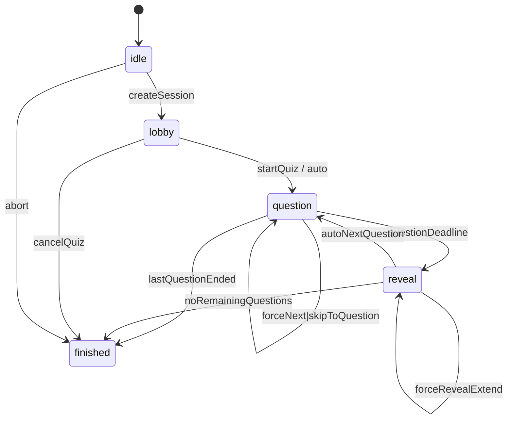

# クイズセッション状態設計とメッセージ仕様

`requirements.md` に基づき、Durable Object (DO) によるクイズセッション管理の状態遷移と WebSocket メッセージ仕様を定義する。参加者 UI・管理者 UI の双方から参照し、フェーズ 04 以降の実装指針とする。

## 1. Durable Object 状態モデル
| フィールド | 型 | 説明 |
| --- | --- | --- |
| `sessionId` | string | セッション識別子。URL/ルーティングで共有 |
| `quizId` | string | 進行対象のクイズ ID |
| `status` | `"idle" \| "lobby" \| "question" \| "reveal" \| "finished"` | セッション状態 |
| `questionIndex` | number | 現在フォーカス中の問題の 0-based index。`-1` は未開始 |
| `questionStartedAt` | number (epoch ms) | 現在の問題が開始された時刻 |
| `questionDeadline` | number (epoch ms) | 回答締切の時刻 |
| `autoProgress` | boolean | 自動進行フラグ。管理者が介入で false になるケースあり |
| `participants` | Map<string, ParticipantState> | 接続中参加者のステータス |
| `pendingResults` | Map<string, AnswerSummary> | 回答締切後の結果計算キャッシュ |
| `adminSockets` | Set<WebSocketId> | 管理画面向け WebSocket 接続一覧 |
| `participantSockets` | Map<string, Set<WebSocketId>> | 参加者 ID ごとの WebSocket 集合 |
| `queue` | Array<PendingCommand> | 管理者操作や自動遷移の予定キュー |

補助型例:
```ts
interface ParticipantState {
  userId: string;
  displayName: string;
  connected: boolean;
  lastSeen: number;
  answer?: {
    questionId: string;
    choiceId: string;
    submittedAt: number;
  };
}

interface AnswerSummary {
  questionId: string;
  totals: Record<string, number>; // choiceId -> count
}

interface PendingCommand {
  type: 'auto-next' | 'force-end' | 'force-start' | 'skip';
  scheduledAt: number;
  payload?: Record<string, unknown>;
}
```

## 2. 状態遷移図


- `idle`: セッションが DO に作成された直後。クイズ設定や参加 URL 発行のみが許可される。
- `lobby`: 参加者が接続し待機する状態。管理者の `startQuiz` 操作で `question` に遷移。
- `question`: 問題が表示され回答受付中。制限時間経過か管理者操作で `reveal` へ。
- `reveal`: 正解・結果を表示。自動進行が有効なら設定時間経過後に次の `question` へ。
- `finished`: セッション終了。結果閲覧のみ許可。

## 3. 遷移イベント詳細
| イベント | ソース状態 | デスティネーション | トリガー | 主なアクション |
| --- | --- | --- | --- | --- |
| `createSession` | `[ * ]` | `idle` | HTTP API でセッション生成 | D1 にセッション行追加、DO インスタンス初期化 |
| `startQuiz` | `lobby` | `question` | 管理画面操作 | `questionIndex=0`、タイマー開始、`quiz_start`/`question_start` をブロードキャスト |
| `auto` | `lobby` | `question` | 自動開始設定 (省略可) | 同上。開始時刻を即時記録 |
| `questionDeadline` | `question` | `reveal` | タイマー満了 or `forceEndQuestion` | 回答締切、集計、`question_end`/`answer_result` 送信、結果キャッシュ更新 |
| `autoNextQuestion` | `reveal` | `question` | タイマー満了 | 次問題をロード、タイマー再設定、`question_start` 送信 |
| `forceNext` | `question` | `question` | 管理者「次へ」操作 | 現問締切→次問開始を連続で実行 |
| `skipToQuestion` | `question/reveal` | `question` | 管理者スキップ操作 | 指定 index の問題を読み込み、タイマー再設定、ステータス更新 |
| `forceRevealExtend` | `reveal` | `reveal` | 管理者「リザルト延長」 | リザルト表示時間を延長し `questionDeadline` を更新 |
| `lastQuestionEnded` | `question` | `finished` | 最終問題終了 | `quiz_finish` 送信、DO 状態を結果閲覧モードに切替 |
| `cancelQuiz` | `lobby` | `finished` | 管理者キャンセル | `quiz_cancelled` 通知、D1 にステータス反映 |
| `abort` | `idle` | `finished` | セッション削除 | クリーンアップ後 `finished` として扱う |

## 4. WebSocket メッセージ仕様
### 4.1 共通ヘッダー
全メッセージで以下のヘッダーを利用する。
```json
{
  "type": "quiz_start",
  "sessionId": "sess_xxx",
  "timestamp": 1700000000000
}
```
- `type`: メッセージ識別子。
- `sessionId`: 対象セッション。
- `timestamp`: サーバー送信時刻 (ms)。

### 4.2 クライアント → サーバー
| `type` | 対象 | 目的 | ペイロード例 |
| --- | --- | --- | --- |
| `join_session` | 参加者/管理者 | WebSocket 接続確立直後に送信。役割とユーザー ID を伝える | `{ "role": "participant", "userId": "u123", "participantKey": "abc" }` |
| `submit_answer` | 参加者 | 現在の問題に対し回答を送信 | `{ "questionId": "q45", "choiceId": "c2" }` |
| `heartbeat` | 参加者/管理者 | 接続維持・死活監視 | `{ "lastEventId": "evt-0012" }` |
| `admin_control` | 管理者 | `forceEndQuestion`, `startQuiz`, `skipToQuestion` 等の操作 | `{ "action": "forceEndQuestion" }` |
| `request_sync` | 参加者/管理者 | 再接続時など、現状態の再送要求 | `{}` |

- 不正な操作 (`submit_answer` が締切後等) は `error` メッセージで応答。

### 4.3 サーバー → 参加者
| `type` | 目的 | ペイロード (JSON) |
| --- | --- | --- |
| `session_ready` | 現在のセッション情報を初期化時に送付 | `{ "status": "lobby", "quiz": {...}, "participants": [...], "questionIndex": -1 }` |
| `quiz_start` | クイズ開始時通知 | `{ "questionIndex": 0, "question": {...}, "deadline": 1700000010000 }` |
| `question_start` | 新しい問題の開始 | `{ "questionIndex": 2, "question": { "id": "q45", "text": "...", "choices": [{ "id": "c1", "text": "A" }] }, "deadline": 1700000050000 }` |
| `question_end` | 回答受付終了 | `{ "questionIndex": 2 }` |
| `answer_result` | 個別参加者向けの結果通知 | `{ "questionIndex": 2, "isCorrect": true, "correctChoiceId": "c2" }` |
| `question_summary` | 集計結果を配信。管理者には正解選択肢一覧を含める | `{ "questionIndex": 2, "totals": { "c1": 10, "c2": 22 }, "correctChoiceIds": ["c2"] }` |
| `quiz_finish` | クイズ終了 | `{ "finalScore": 8, "rank": 5 }` (参加者別) |
| `error` | エラー通知 | `{ "code": "answer_closed", "message": "Answer window closed." }` |

### 4.4 サーバー → 管理者専用
| `type` | 目的 | ペイロード |
| --- | --- | --- |
| `admin_session_state` | 現在の状態全体をスナップショットで送信 | `{ "status": "question", "questionIndex": 1, "deadline": 1700000030000, "participants": [...], "autoProgress": true }` |
| `participant_update` | 参加者接続状況の変化 | `{ "userId": "u123", "connected": false }` |
| `admin_log` | 重要イベントのログストリーム | `{ "level": "info", "message": "Question 2 started" }` |

### 4.5 イベント粒度とUI適用指針
- `answer_result`
  - 対象: 各参加者個別。
  - タイミング: `question_end` 後すぐに送信。
  - 用途: 自身の正誤・正解選択肢を即時に表示。参加者 UI は受信後に正解表示と次問題までの待機モードに切り替える。
- `question_summary`
  - 対象: 参加者 (任意) / 管理者 (必須)。
  - タイミング: 集計完了時、`answer_result` 発火後に送信。
  - 用途: 管理者 UI でグラフや表として集計を表示。参加者に配信する場合はランキングや全体傾向の共有用。
- `admin_session_state`
  - 対象: 管理者のみ。
  - 用途: 再接続時に全状態を再構築。UI はこのスナップショットをベースに、以後の増分イベント (`question_start`, `participant_update` など) を適用する。

イベント順序保証:
1. `question_end`
2. `answer_result` (各参加者向け)
3. `question_summary` (集計表示)
4. `admin_log` (任意)

Durable Object は上述の順序を保ちながらブロードキャストすることで UI 側の状態不整合を防ぐ。

## 5. フェイルセーフと再接続
1. **再接続時フロー**
   - 画面オフやページリロードで WebSocket が切断された場合、クライアントは既知の参加者IDとセッションIDで自動的に `join_session` を再送し、続けて `request_sync` を実行する。
   - DO は `session_ready` と直近の `question_start` もしくは `reveal` イベントを再送し、UI は現在の問題表示・残り時間を再構築する。
   - 締切に近い場合は `deadline` を現在時刻基準で再計算して送付し、残秒数が正しく表示されることを保証する。
   - 切断前に送信済みの回答・結果表示は維持され、重複送信は冪等に扱う。
2. **タイマー精度**
   - DO 側で `setTimeout` ではなく Durable Object Alarm を利用し、ミリ秒単位でスケジューリング。
   - 管理者が手動介入した場合は既存アラームをキャンセルして再登録。
3. **データ整合性**
   - `submit_answer` 受理時に D1 へ即書き込み。Durable Object 内では participant state の `answer` を更新。
   - 再送防止のため `answer` フィールドが存在する場合は idempotent に扱い `error` を返さない。

## 6. 次のステップ
- メッセージと API の責務境界を整理し、HTTP API が担う操作 (`createQuiz`, `listQuestions` など) を別表化。
- `answer_result` や `question_summary` の役割分担 (個人向け vs 全体向け) を UI 要件と照合して確定。
- Diagram を README か `docs/` ディレクトリに組み込み、ステークホルダー合意を取得。
